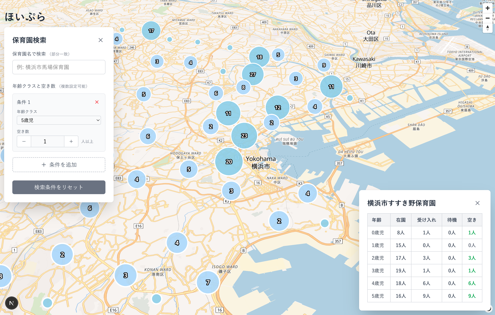

# ほいぷら - 保育園検索サービス



[ほいぷら](https://hoipla.vercel.app)

横浜市のオープンデータを使用して空きのある保育園を楽に探せるサービスです。

## インフラ構成図


> 横浜市のオープンデータを使用
>
> https://www.city.yokohama.lg.jp/kosodate-kyoiku/hoiku-yoji/shisetsu/riyou/info/nyusho-jokyo.html

## 開発環境
docker-compose.ymlが配置されたディレクトリ内に`.env`を作成
```
VOLUME=.data

# MySQL
MYSQL_DATABASE=app_db
MYSQL_ROOT_PASSWORD=root
MYSQL_USER=app_user
MYSQL_PASSWORD=app_pass
MYSQL_PORT=3306
MYSQL_HOST=db

S3_ACCESS_KEY=YOUR_S3_ACCESS_KEY
S3_ACCESS_SECRET_KEY=YOUR_S3_ACCESS_SECRET_KEY
```

### Goバッチの起動
```console
$ docker compose up -d
```

### Next.js フロント
Next.js用の`.env.local`を作成する必要があります。
手順はwebフォルダ内のREADME.mdに記載されています。
```console
$ cd web
$ npm run dev
```
