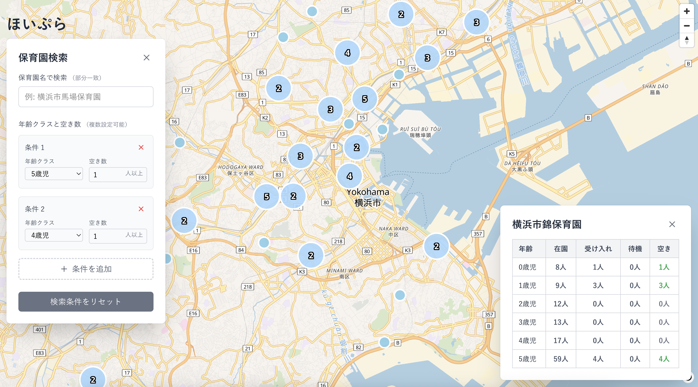
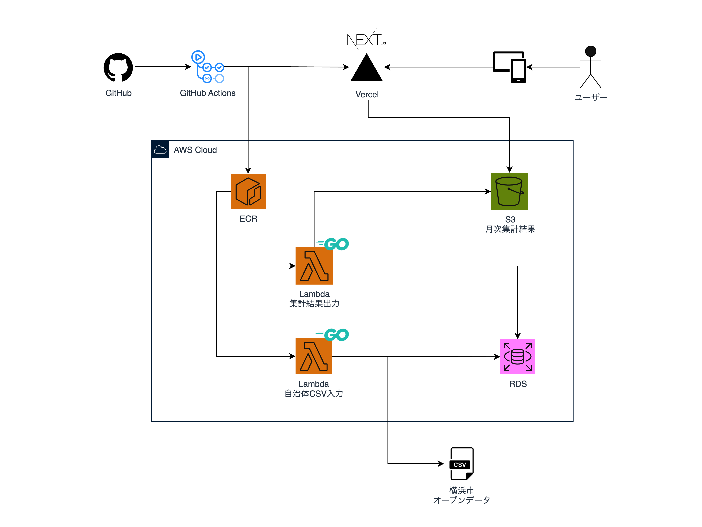

# ほいぷら - 保育園検索サービス

[ほいぷら](https://hoipla.vercel.app)

横浜市のオープンデータを使用して空きのある保育園を楽に探せるサービスです。

## インフラ構成図

> 横浜市のオープンデータを使用
>
> https://www.city.yokohama.lg.jp/kosodate-kyoiku/hoiku-yoji/shisetsu/riyou/info/nyusho-jokyo.html
